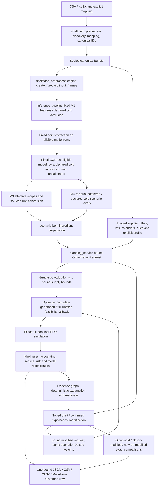

# Runtime ownership and migration

The production checkout is this `source_code` directory. Review harnesses are external; runtime never imports them. `run.ps1` sets PYTHONPATH here and uses the declared interpreter. Config/What-if/typed runners print their import origins. Existing config_runner and what_if_runner were present in this checkout; they were migrated rather than replaced with a test runner.

Entrypoints: `shelfcash_pipeline.config_runner.main` → `run.run_pipeline` → preprocess/m1/point_correction/m2/m3/m4/m5/m6 stage `run` functions. Forecast public APIs forward `ForecastOverridePolicy` and horizon. Application `ForecastPlanConfig` follows the same stage services. Typed M5: `planning_service.run_typed_planning` → `optimizer.optimize_procurement` → deterministic/stochastic/decomposition → `lot_milp.solve_lot_procurement` → `resimulation.evaluate_candidate_plan` → exact simulator and `critic`.

Chronology authority: `optimization.chronology` provides opportunity arrival, expiry offset and planned lot identity; opportunity builder, MILP, resimulation, constraints, critic and export consume it. Inventory expiry/FEFO order is shared with `inventory.fefo`. Daily receiving peak precedes expiry disposal and consumption; ending stock is distinct. Initial lots and confirmed inbound remain distinct, and orders are ex ante across worlds.

What-if production runner → `draft_what_if` / `confirm_what_if` / `run_what_if` → mutation/binding → real optimizer → exact comparisons → `export_what_if_planning` → shared customer exporter; `explain_what_if` uses typed evidence. No natural-language parsing or LLM is required. The CLI baseline reader validates accepted-artifact/request/M6 physical agreement and uses an explicit read-only currency adapter for historical metadata; original files remain untouched.

Schema migration: OptimizationResult and customer package schema2, scenario-preview planning schema3. Historical profile v3 is retained as reference; new profiles are v4/v5. Schema2 customer filenames use generic inventory and terminal-expiry names. No Apple-to-banana compatibility alias exists. Display string escaping applies only to spreadsheet presentation; JSON preserves original IDs/names. A package is complete only after staging, workbook readback and atomic publication. An export error preserves the accepted technical result and reports a separate error for rerun into a fresh destination.

Model/CQR/residual artifacts are read-only. No training, parameter fitting, artifact reselection, supplier execution or LLM call occurs in these entrypoints. Scenario assumptions, technical acceptance, business readiness and execution authorization remain separate authorities.
